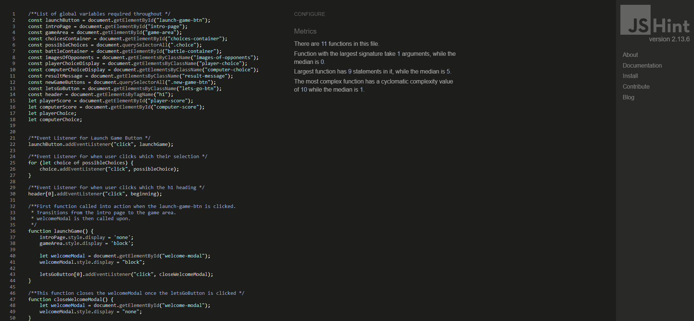

# ROCK, PAPER, SCISSORS

 

This version of the rock, paper, scissors game that everyone is familiar with and puts a fun variation on the classic. The fundamentals are the same, you either win lose or draw with every go. The user makes a choice and this then competes against the choice the computer has generated. There are only three choices so the odds aren't completely stacked against you. In this game the rock option is replaced with "the-rock", the paper option is replaced with "paper-airplane" and the scissors option is replaced with "Edward-Scissorhands". The winner is determined on who reaches 5 first. It is a true battle of the odds with the computer.

   

[View Rock, Paper, Scissors live game on Github pages here](https://jayodonoghue.github.io/ROCK-PAPER-SCISSORS-PP2/)

---

## CONTENT

---

## User Experience (UX)  

  

### User Stories

 

#### First Time Visitors Goals

* I want to play a game of rock, paper scissors against the computer.
* I want to make my selection and for the computer to randomly generate an opposing selection.
* I want the site to be responsive to my device.
* I want the site to be easy to navigate.

#### Returning Visitor Goals

* I want to see a display modal appear to inform who the winner of the game is.
* I want to be able to start a new game once a winner from the previous game is declared.

#### Frequent Visitor Goals

* I want to be click the header heading allowing me to return to the beginning.
* I want to be able to continue to play for no matter how long with the reassurance that the game will perform with consistency every time. 
 
 

---

## Design

 

### Colour Scheme

 

As there were images used as buttons and used for displaying the users/computers choice I chose to keep the colour scheme minimalistic. I added the radial gradient effect as to add a touch of styling without overwhelming the user. The splash of aquamarine is there in order for the site not to be completely made up of variants of white and black. The colour palette was created by using the [Coolors](https://coolors.co/) website.

 

### Typography

 

The following two fonts were picked as they complimented each other.

 * Sedgwick Ave Display. This is an informal type of text used for the headings typically - I feel it is a suitable font for games.
 * Montserrat is used for the remainder of the text areas. This is  sans-serif font.

 

### Imagery

 

 All images are taken from websites which are correctly credited in the credits section.

 

### Wireframes

 

Wireframes were created for mobile, the desktop is the exact same layout with just larger elements.

 

Introduction page

 

Choice Container

 

Battle Container

 

Welcome Modal

 

Result Modal

 

### Accessibility

I have achieved a high level of accessibility by using the following:

* Using aria-labels.
* Ensuring there is a clear colour contrast throught the site. Initially the colour contrast for the font colours I had chosen was not defined enough however by adding a text shadow to the items it provides a clear contrast.
* Using semantic HTML.

 

---

 

## Technologies Used

 

### Languages Used

 

* HTML
* CSS 
* JavaScript

### Frameworks, Libraries & Programs Used

 

* Balsamiq - This was used to create the wireframes.
* Git - This was used for version control.
* Github - This was used to save and store all the files for the website.
* Font Awesome - This was used for the icons in the website.
* Google fonts - This was used to import the fonts used for the website.
* Google Dev Tools - This was used to test different code and features.
* Am I Responsive - This was used to show the website on a variety of different screens.

 

---

 

## Testing

 

### HTML Validator

 

The HTML Validator was used on every HTML aspect of the project.

 

 

### CSS Validator

 

The CSS Validator was used on every CSS aspect of the project.

 

 

### JavaScript Validator

 

JS Hint was used on every JavaScript aspect of the project.

 

 

### Lighthouse

 

I used the Lighthouse feature in the Chrome Developer Tools to test the performance, accessibility, best practices and SEO of the website.

 

 

### Solved Bugs

 

1. When adding eventt listener for possibleChoices in JavaScript, there was an error showing on the console. This was due to my loop being an 'in' loop rather than an 'of' loop and after altering this the error displaying on the console was eradicated. 

 

2. When creating the playerChoice and computerChoice switch case I could not get the choice to replicate the image of their choice. However after using Dev Tools I was able to test certain variables and needed to alter some code to include children in completing my statements.

3. When creating the modals I was unsure on how to get the pages to transition etc. This reulted in fade in and out classes being added but to no avail. However after reading anf using the code for W3C School the modals worked perfectly.

4. When creating the function for the game to end once the player or computer reaches a score of 5 I used innerHTML = 5. However after further investigation I realised the numbers were being logged as strings so once the innerHTML was change to innerText and the value 5 was change to a string "5" the function worked correctly.

 

### Known Bugs

 

I have no unresolved bugs.

### Full Testing

* The site was fully tested using a range of browsers (Google Chrome, Safari, Firefox).
* The site was fully tested using a range of devices (DELL Large Screen Monitor, ASUS Laptop, iPhone 13, iPhone 7, Huawei P40 and Samsung S8)
* The site was fully tested using Chrom Dev Tools to test the responsiveness on different screen sizes. Dev Tools was also used to use to test reults to the console.
* The link in the game was fully tested. The link worked as expected. All internal links leading to the relevant page and all external links leading to a new tab.
* All buttons were tested ensuring that once activated they completed the correct function.

 

### Testing Users Stories

 

`First Time Visitors`

| Goals | How are they achieved? |
| :--- | :--- |
| I want to play a game of rock, paper scissors against the computer. | The site is fun way to play this game and is available to use whenever the user wishes. |
| I want to make my selection and for the computer to randomly generate an opposing selection. | There are functions created for this action to take place. So all the user has to worry about is making their own choice while the computer does the rest. |
| I want the site to be responsive to my device. | This site has been developed to be responsive on all screen sizes. |
| I want the site to be easy to navigate. | This game takes a minimalistic approach in terms of content however this is purposely done as to not distract the user and to focus solely on the actual game aspects. Buttons are used for easy navigation through the site. |

`Returning Visitors`

|  Goals | How are they achieved? |
| :--- | :--- |
| I want to see a display modal appear to inform who the winner of the game is. | A function was created to determine the winner once either the player or the computer reached 5. Once this happened a modal would appear to inform the user who the winner is. |
| I want to be able to start a new game once a winner from the previous game is declared. | Once the winner is displayed on the modal there is a button on the bottom giving the user an option to start a new game. |

`Frequent Visitors`

| Goals | How are they achieved? |
| :--- | :--- |
| I want to be click the header heading allowing me to return to the beginning | An event listener was added to the h1 heading to incorporate a click event. This reults in the user being able to click on this heading and refreshing the game bringing you back to the intro page with the scores reset to 0. |
| I want to be able to continue to play for no matter how long with the reassurance that the game will perform with consistency every time. | This game will repeat the process of starting a new game once the user wishes to do so for as many times and with each function working correctly each time. |

- - -
