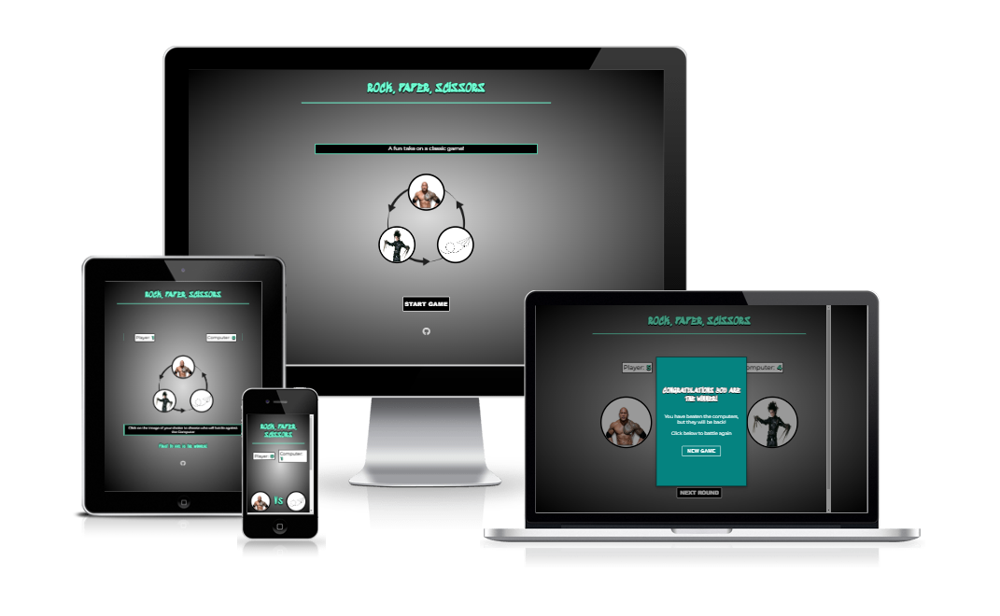
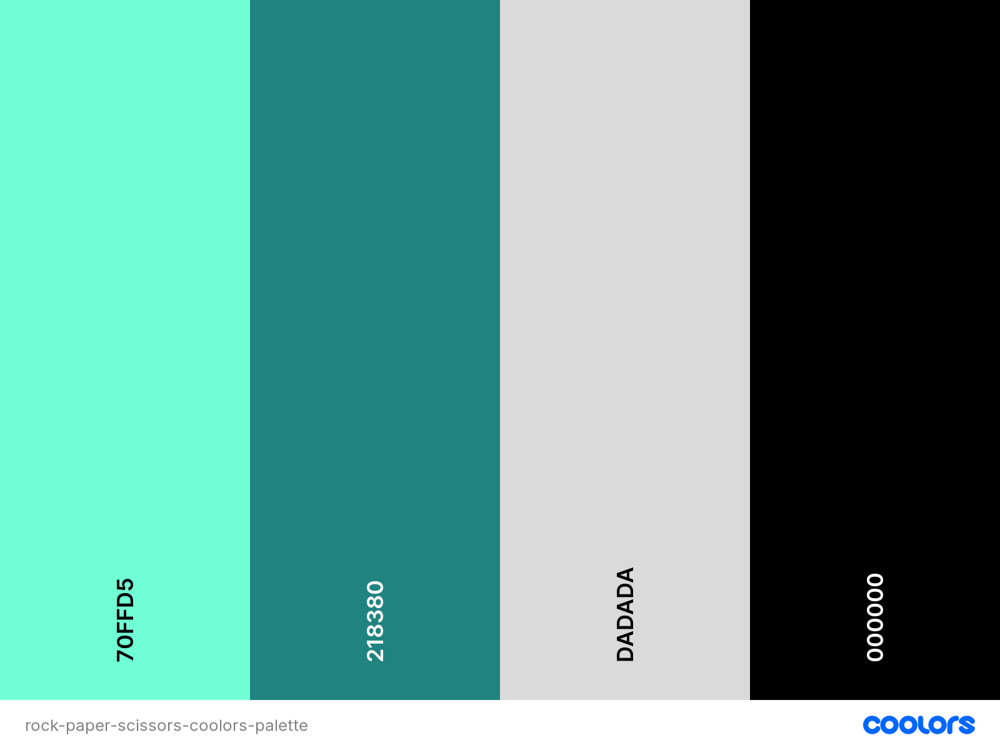

# ROCK, PAPER, SCISSORS

 

This version of the rock, paper, scissors game that everyone is familiar with and puts a fun variation on the classic. The fundamentals are the same, you either win lose or draw with every go. The user makes a choice and this then competes against the choice the computer has generated. There are only three choices so the odds aren't completely stacked against you. In this game the rock option is replaced with "the-rock", the paper option is replaced with "paper-airplane" and the scissors option is replaced with "Edward-Scissorhands". The winner is determined on who reaches 5 first. It is a true battle of the odds with the computer.

   

[View Rock, Paper, Scissors live game on Github pages here](https://jayodonoghue.github.io/ROCK-PAPER-SCISSORS-PP2/)

---

## CONTENT

---

## User Experience (UX)  

  

### User Stories

 

#### First Time Visitors Goals

* I want to play a game of rock, paper scissors against the computer.
* I wamnt to make my selection and for the computer to randomly generate an opposing selection.
* I want the site to be responsive to my device.
* I want the site to be easy to navigate.

#### Returning Visitor Goals

* I want to see a display modal appear to inform who the winner of the game is.
* I want to be able to start a new game once a winner from the previous game is declared.

#### Frequent Visitor Goals

* I want to be able to continue to play for no matter how long with the reassurance that the game will perform with consistency every time. 
 
 

---

## Design

 

### Colour Scheme

 

As there were images used as buttons and used for displaying the users/computers choice I chose to keep the colour scheme minimalistic. I added the radial gradient effect as to add a touch of styling without overwhelming the user. The splash of aquamarine is there in order for the site not to be completely made up of variants of white and black. The colour palette was created by using the [Coolors](https://coolors.co/) website.

 

### Typography

 

The following two fonts were picked as they complimented each other.

 * Sedgwick Ave Display. This is an informal type of text used for the headings typically - I feel it is a suitable font for games.
 * Montserrat is used for the remainder of the text areas. This is  sans-serif font.

 

### Imagery

 

 All images are taken from websites which are correctly credited in the credits section.

 

### Wireframes

 

Wireframes were created for mobile, the desktop is the exact same layout with just larger elements.

 

Introduction page

 

Choice Container

 

Battle Container

 

Result Modal

 

## Testing

 

### HTML Validator

 

The HTML Validator was used on every HTML aspect of the project.

 

 

### CSS Validator

 

The CSS Validator was used on every CSS aspect of the project.

 

 

### Lighthouse

 

I used the Lighthouse feature in the Chrome Developer Tools to test the performance, accessibility, best practices and SEO of the website.

 

 